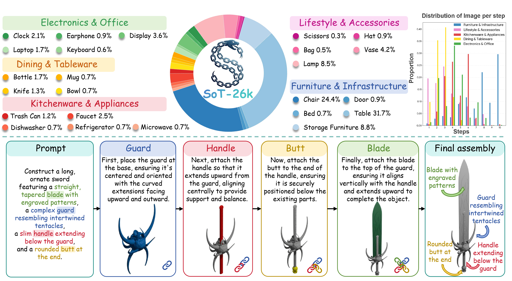
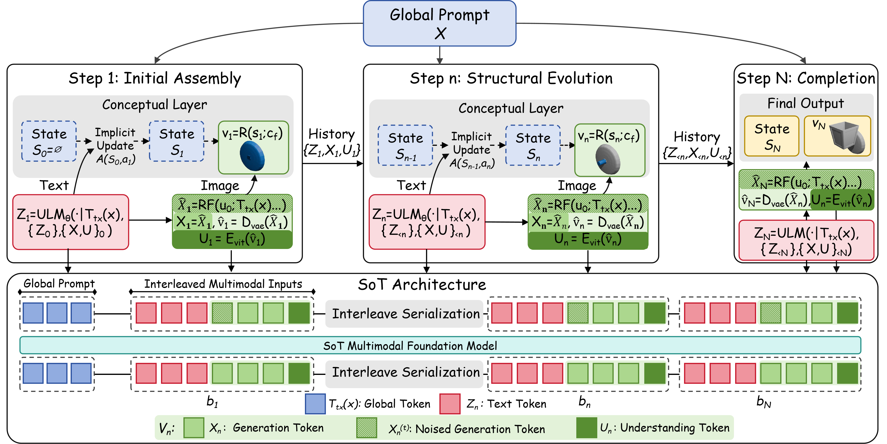
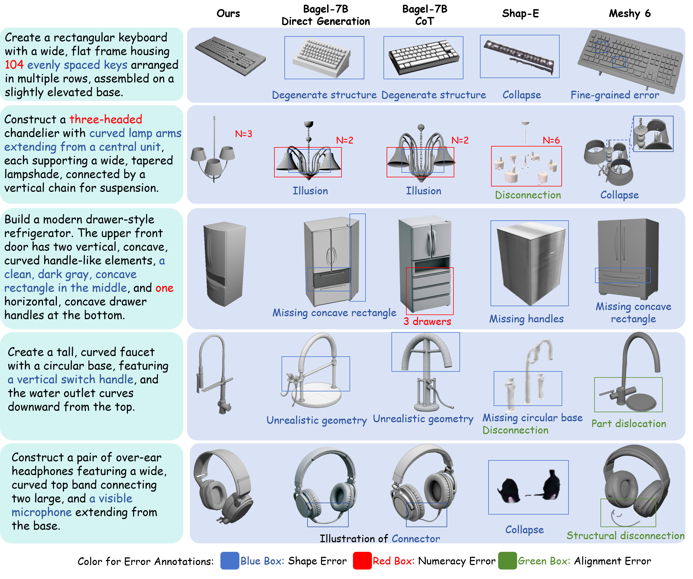
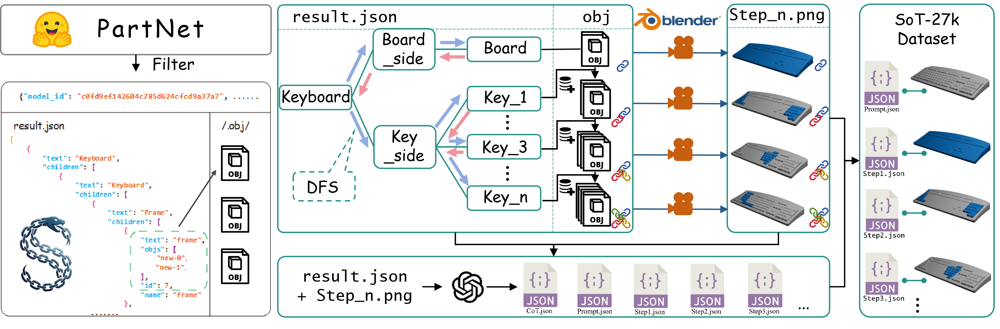
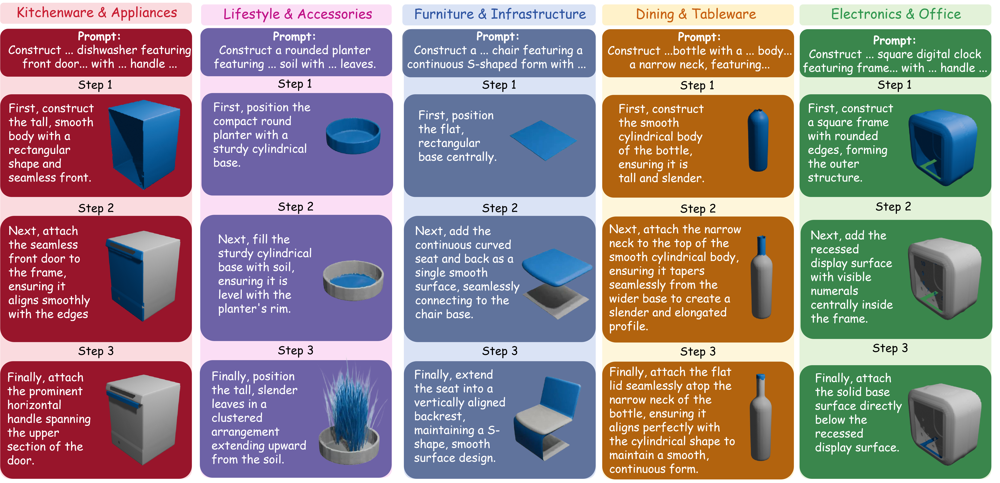

# Shape of Thought

<p align="center">
  <strong>Progressive Object Assembly via Visual Chain-of-Thought</strong>
</p>

<p align="center">
  <a href="https://arxiv.org/abs/2601.21081"></a>
  <a href="https://huggingface.co/datasets/yuhuo03/SoT-26K"></a>
  <a href="https://yuhuo03.github.io/sot/"></a>
  
</p>

Official implementation of **Shape of Thought: Progressive Object Assembly via Visual Chain-of-Thought**, accepted to **ICML 2026**.

Shape-of-Thought (SoT) is a visual Chain-of-Thought framework for process-supervised progressive object assembly in the rendered 2D domain. Given a text prompt, SoT generates an interleaved trace of textual construction rationales and rendered intermediate states, making the assembly process inspectable step by step without external engines at inference time.

<p align="center">
  
</p>

## Scope

SoT is trained and evaluated on rendered assembly traces. This repository focuses on rendered-domain structural control and process supervision rather than native editable 3D generation.

## Method Overview

SoT turns one-shot object generation into a visible assembly trace: each textual construction decision is immediately grounded by a rendered intermediate state.

<p align="center">
  
</p>

## Highlights

- **Visual Chain-of-Thought for assembly:** SoT decomposes object generation into sequential textual rationales and rendered intermediate states.
- **Step-aligned supervision:** SoT-26K contains 25,929 grounded assembly traces derived from part-based CAD hierarchies across 24 object categories.
- **Structure-aware evaluation:** T2S-CompBench evaluates component numeracy, shape fidelity, attribute faithfulness, connectivity, topology, rationale alignment, and trace stability.

## Results

| Method | Component Numeracy | Structural Topology | Rationale Alignment | Trace Stability |
| --- | ---: | ---: | ---: | ---: |
| Direct generation | 64.26 | 65.42 | - | - |
| Text-only CoT | 75.88 | 71.38 | 45.49 | 32.71 |
| **Shape-of-Thought** | **88.44** | **84.76** | **79.19** | **91.30** |

SoT improves over direct generation by **+24.2 points** on component numeracy and **+19.3 points** on structural topology under T2S-CompBench.

<p align="center">
  
</p>

## SoT-26K

SoT-26K packages part-based CAD hierarchies as vision-language assembly traces. The model only consumes rendered states and textual rationales; meshes and part poses are used for trace construction.

<p align="center">
  
</p>

The full SoT-26K dataset is available on Hugging Face:

```text
https://huggingface.co/datasets/yuhuo03/SoT-26K
```

This repository includes a small sample shard under `SoT-26K/` to illustrate the expected parquet layout. The main dataset loader is:

```text
data/interleave_datasets/sot_dataset.py
```

## Qualitative Examples

<p align="center">
  
</p>

## Quick Start

```bash
git clone https://github.com/yuhuo03/Shape-of-Thought.git
cd Shape-of-Thought

conda create -n sot python=3.10 -y
conda activate sot
pip install -r requirements.txt
pip install flash_attn --no-build-isolation
```

The code assumes CUDA-enabled GPUs. The provided launch scripts are templates and should be adapted to your local checkpoint paths, GPU memory, and distributed setup.

## Repository Layout

```text
.
├── SoT-26K/                  # Sample SoT-26K parquet shard
├── assets/                   # README figures
├── data/                     # Dataset loading and preprocessing utilities
│   ├── configs/              # Example dataset configuration files
│   └── interleave_datasets/  # Interleaved text-image dataset loaders
├── modeling/                 # Multimodal model components
│   ├── bagel/                # Unified autoregressive multimodal backbone
│   ├── qwen2/                # Language model components
│   └── siglip/               # Vision encoder components
├── scripts/                  # Training launch scripts
├── train/                    # Training utilities
├── inferencer.py             # Interleaved inference utilities
├── sot_inference.py          # Example SoT inference script
└── requirements.txt          # Python dependencies
```

## Inference

Update the checkpoint paths near the top of `sot_inference.py`:

```python
checkpoint_dir = "your/path/to/models/BAGEL-SoT"
checkpoint_file = "your/path/to/model.safetensors"
```

Then run:

```bash
python sot_inference.py
```

The script saves:

- rendered intermediate states under `reasoning_output_<timestamp>/images/`,
- construction rationales and metadata in `reasoning_output_<timestamp>/reasoning_data.json`,
- the final rendered assembly state.

Example prompts and inference hyperparameters can be edited directly in `sot_inference.py`.

## Training

Set `PYTHONPATH`, `WANDB_API_KEY`, `MODEL_PATH`, node settings, token budgets, and output directories in:

```text
scripts/train.sh
```

Then launch training with:

```bash
bash scripts/train.sh
```

The default script uses `torchrun` and the example dataset configuration:

```text
data/configs/example.yaml
```

## Citation

```bibtex
@misc{huo2026shapethoughtprogressiveobject,
      title={Shape of Thought: Progressive Object Assembly via Visual Chain-of-Thought}, 
      author={Yu Huo and Siyu Zhang and Kun Zeng and Haoyue Liu and Owen Lee and Junlin Chen and Yuquan Lu and Yifu Guo and Yaodong Liang and Xiaoying Tang},
      year={2026},
      eprint={2601.21081},
      archivePrefix={arXiv},
      primaryClass={cs.CV},
      url={https://arxiv.org/abs/2601.21081}, 
}
```

## License and Usage

No license file is currently included in this repository. Please contact the authors for questions about academic or commercial use.
